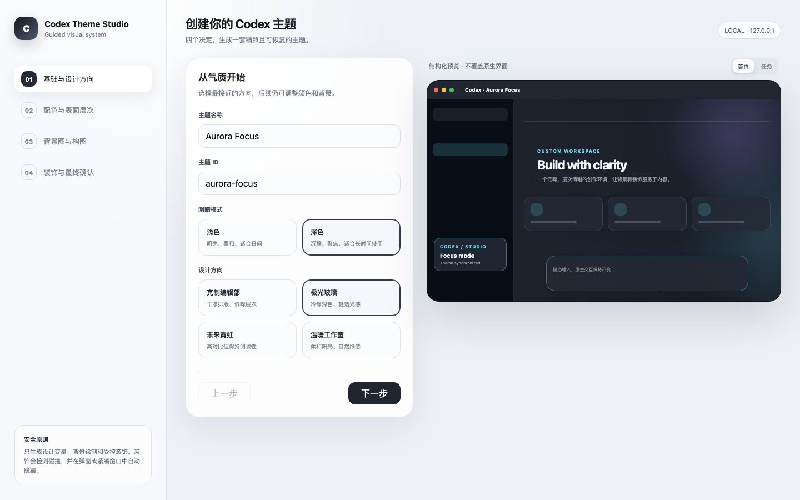

# Codex Theme Studio

[简体中文](README.zh-CN.md)

An interactive Codex Skill for designing, generating, previewing, applying, validating, exporting, and safely restoring polished themes for the official Codex desktop app.



## Highlights

- Guided four-step HTML theme studio instead of a long configuration form.
- Light and dark modes with curated editorial, aurora, cyber, and warm directions.
- Coordinated semantic colors, typography, radius, border, shadow, and surface treatments.
- Local PNG, JPEG, or WebP background artwork with a legibility veil and focal-position control.
- Optional AI-art workflow: the studio records a background prompt, and Codex can generate and bundle the final bitmap.
- Trusted, pointer-inert decoration templates with live collision detection.
- Automatic hiding on dialogs, compact windows, missing anchors, or unsafe space.
- Reversible loopback CDP injection; the signed app bundle and `app.asar` are never modified.
- Portable `.codex-theme` import/export with size, path, and CSS safety validation.
- Bundled `aurora-focus` sample theme and artwork.

## Requirements

- macOS 12 or later.
- Official Codex desktop app installed as `/Applications/ChatGPT.app` or `~/Applications/ChatGPT.app`.
- Node.js 22 or later.
- Codex with local Skills support.

The current launcher and restore workflow target macOS. The compiler, package validation, HTML studio, and tests are platform-neutral; Windows launch integration is not included yet.

## Install

Clone the repository directly into the Codex Skills directory:

```bash
mkdir -p "${CODEX_HOME:-$HOME/.codex}/skills"
git clone https://github.com/Way-To-AGI/codex-theme-studio.git \
  "${CODEX_HOME:-$HOME/.codex}/skills/codex-theme-studio"
```

Restart Codex so the Skill appears in the Skills list.

Update later with:

```bash
git -C "${CODEX_HOME:-$HOME/.codex}/skills/codex-theme-studio" pull --ff-only
```

## Start the visual studio

```bash
cd "${CODEX_HOME:-$HOME/.codex}/skills/codex-theme-studio"
node scripts/studio-server.mjs
```

The server binds only to `127.0.0.1` and opens the local studio in your browser. Choose:

1. Mode and design direction.
2. Palette, radius, and shadow system.
3. Background source, focal position, and reading veil.
4. Decoration density and copy.

The generated theme is written under `themes/<theme-id>/`.

## Use from Codex

Invoke the Skill and describe the desired result, for example:

```text
Use $codex-theme-studio to create a calm light theme with a misty mountain background and minimal decoration.
```

When AI artwork is requested, Codex should generate a wide bitmap with quiet negative space behind the central reading column and composer, save it locally, then compile it with `--art`.

## CLI workflow

Compile a JSON brief:

```bash
node scripts/compile-theme.mjs \
  --brief /absolute/path/theme-brief.json \
  --art /absolute/path/background.png
```

Apply a theme:

```bash
node scripts/start-theme.mjs --theme aurora-focus
```

If Codex is already running without the loopback CDP port, the launcher stops safely. Close Codex first, or explicitly authorize a restart:

```bash
node scripts/start-theme.mjs --theme aurora-focus --restart-existing
```

Verify and capture a screenshot:

```bash
node scripts/runtime.mjs \
  --verify \
  --port 9335 \
  --theme aurora-focus \
  --screenshot /absolute/path/verification.png
```

Restore the native renderer:

```bash
node scripts/restore-theme.mjs
```

## Import and export

Export a portable theme:

```bash
node scripts/export-theme.mjs \
  --theme aurora-focus \
  --output /absolute/path/aurora-focus.codex-theme
```

Import an untrusted package safely:

```bash
node scripts/import-theme.mjs --input /absolute/path/theme.codex-theme
```

Replacing an existing theme requires the explicit `--force` flag.

## Safety model

- Never edits, patches, replaces, re-signs, or takes ownership of the official app bundle.
- Connects only to `app://` renderers exposed on a loopback CDP port.
- Rejects remote CSS resources, executable CSS, unsafe asset paths, and packages larger than 30 MB.
- Does not accept arbitrary HTML, selectors, scripts, handlers, or coordinates in theme briefs.
- Keeps decorations `aria-hidden` and `pointer-events: none`.
- Measures native controls and hides decoration when no collision-free slot exists.
- Preserves native control geometry, interaction hierarchy, semantic states, code, diff, terminal, dialog, and composer behavior.
- Stops only watcher processes whose command line matches this Skill.

## Validate

```bash
node scripts/self-test.mjs
```

When installed as a Codex Skill, also run:

```bash
python3 "${CODEX_HOME:-$HOME/.codex}/skills/.system/skill-creator/scripts/quick_validate.py" \
  "${CODEX_HOME:-$HOME/.codex}/skills/codex-theme-studio"
```

## Repository layout

```text
SKILL.md                 Agent workflow and guardrails
agents/openai.yaml       Codex Skill metadata
assets/studio/           Interactive HTML studio
assets/renderer-inject.js Safe renderer adapter
references/              Schema, design system, runtime, and QA contracts
scripts/                 Compiler, runtime, import/export, restore, and tests
themes/aurora-focus/     Bundled sample theme
```

## License and disclaimer

Released under the [MIT License](LICENSE). The bundled aurora artwork was generated for this repository and is distributed under the same license.

This is an independent community project. It is not affiliated with or endorsed by OpenAI. Codex, OpenAI, and related marks belong to their respective owners. When distributing custom themes, you are responsible for the rights to any third-party artwork, brands, characters, or likenesses you include.
