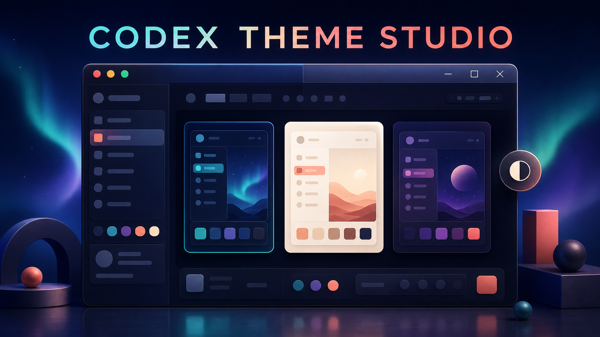
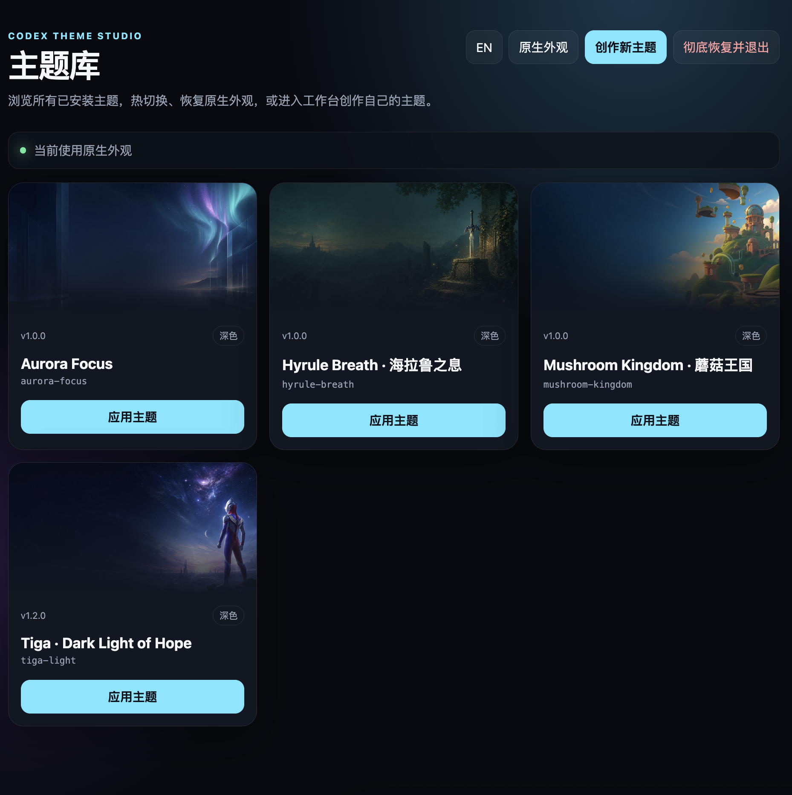

# Codex Theme Studio

[简体中文](README.zh-CN.md) · [Follow updates on X / Twitter](https://x.com/NULL_SSR)

A Codex Skill with Agent-direct and HTML-studio creation modes for designing, generating, previewing, applying, validating, exporting, and safely restoring polished themes for the official Codex desktop app.



## Highlights

- Two creation modes: let the Agent build autonomously in chat, or make each choice in the guided four-step HTML studio.
- Light and dark modes with curated editorial, aurora, cyber, and warm directions.
- Coordinated semantic colors, typography, radius, border, shadow, and surface treatments.
- Semantic palette scoring with automatic correction for mode-incompatible surfaces, text, accents, and supporting colors.
- An explicit light/dark Codex appearance reminder before applying, preventing mixed native surfaces.
- Local PNG, JPEG, or WebP background artwork with a legibility veil and focal-position control.
- Optional AI-art workflow: the studio records a background prompt, and Codex can generate and bundle the final bitmap.
- Trusted, pointer-inert decoration templates with live collision detection.
- Optional read-only Codex quota card with short/long-window remaining percentages, reset time, stale-state handling, and no credentials in theme packages.
- Automatic hiding on dialogs, compact windows, missing anchors, or unsafe space.
- Reversible loopback CDP injection; the signed app bundle and `app.asar` are never modified.
- Portable `.codex-theme` import/export with size, path, and CSS safety validation.
- Bundled `aurora-focus` and dark Tiga `tiga-light` sample themes with artwork.
- Three synchronized quick-switch clients: a visual web library, a collision-aware in-app `◐` picker, and a CLI.
- Live switching without restarting Codex after the one-time loopback runtime activation, with serialized changes and automatic rollback.

## Requirements

- macOS 12 or later, or Windows 10/11.
- Official Codex desktop app: `ChatGPT.app` on macOS, or an OpenAI-signed `ChatGPT.exe` / `Codex.exe` on Windows.
- Node.js 22 or later.
- Codex with local Skills support.

The launcher discovers the signed official app without modifying its bundle, `WindowsApps`, or `app.asar`. Windows state is stored under `%LOCALAPPDATA%\CodexThemeStudio` with a private user ACL.

## Install

Clone the repository directly into the Codex Skills directory:

macOS:

```bash
mkdir -p "${CODEX_HOME:-$HOME/.codex}/skills"
git clone https://github.com/Way-To-AGI/codex-theme-studio.git \
  "${CODEX_HOME:-$HOME/.codex}/skills/codex-theme-studio"
```

Windows PowerShell:

```powershell
$skillRoot = Join-Path $env:USERPROFILE ".codex\skills"
New-Item -ItemType Directory -Force $skillRoot | Out-Null
git clone https://github.com/Way-To-AGI/codex-theme-studio.git (Join-Path $skillRoot "codex-theme-studio")
```

Restart Codex so the Skill appears in the Skills list.

For a desktop-friendly visual library, run `scripts/choose-theme.command` on macOS or `scripts\choose-theme.cmd` on Windows. Both ask before the one-time Codex restart if loopback CDP is not active.

Update later with:

```bash
git -C "${CODEX_HOME:-$HOME/.codex}/skills/codex-theme-studio" pull --ff-only
```

## Choose a creation mode

State the mode when invoking the Skill:

```text
Use $codex-theme-studio in Agent direct mode to create a red retro platform-game theme without opening HTML.
Use $codex-theme-studio and open the HTML studio so I can make the choices.
```

If the mode is unclear, the Agent asks you to choose **Agent direct creation** or **HTML studio** before opening a page. Agent direct mode derives the brief, prepares artwork, compiles, applies, and performs live screenshot QA from the chat description. HTML studio mode leaves aesthetic choices to you, then hands the same compiler and QA pipeline back to the Agent.

The CLI also exposes both choices:

```bash
node scripts/theme.mjs create
node scripts/theme.mjs create agent
node scripts/theme.mjs create html
```

`create agent` does not open a page; it directs you back to chat. `create html` opens the existing studio. `node scripts/theme.mjs studio` remains a compatibility alias.

## Start the HTML studio

```bash
cd "${CODEX_HOME:-$HOME/.codex}/skills/codex-theme-studio"
node scripts/studio-server.mjs --wait-for-submit
```

The server binds only to `127.0.0.1` and opens the local studio in your browser. `--wait-for-submit` keeps the calling Agent attached and returns the saved `briefPath`, theme ID, background mode, and optional uploaded-art path after submission. Choose:

1. Mode and design direction.
2. Palette, radius, and shadow system.
3. Background source, focal position, and reading veil.
4. Decoration density, optional remaining-quota card, and copy.

After **Submit design and continue**, the studio atomically saves `brief.json` and hands the result back to the Agent. The page says that no extra message is needed; the Agent must continue through artwork generation, compilation, application, screenshot verification, and iteration instead of stopping at the HTML page.

Launching without `--wait-for-submit` is a standalone fallback. It saves the design brief and clearly warns that no Agent is waiting; it does not compile or apply a theme by itself.

## Use from Codex

Invoke the Skill, state the creation mode, and describe the desired result, for example:

```text
Use $codex-theme-studio in Agent direct mode to create a calm light theme with a misty mountain background and minimal decoration, without opening HTML.
```

When AI artwork is requested, Codex should generate a wide bitmap with quiet negative space behind the central reading column and composer, save it locally, then compile it with `--art`.

## CLI workflow

Quick-switch commands:

```bash
node scripts/theme.mjs list
node scripts/theme.mjs status
node scripts/theme.mjs use aurora-focus
node scripts/theme.mjs web
node scripts/theme.mjs native
node scripts/theme.mjs restore
node scripts/theme.mjs create
node scripts/theme.mjs studio
```

The visual library, the in-app `◐` picker, and these commands share one loopback manager and one active-theme state. `native` removes theme paint but keeps quick switching available. `restore` removes the theme, in-app control, manager, and watcher.



Inspect the recommended appearance and palette quality before applying:

```bash
node scripts/preflight-theme.mjs --theme aurora-focus
```

Compile a JSON brief:

```bash
node scripts/compile-theme.mjs \
  --brief /absolute/path/theme-brief.json \
  --art /absolute/path/background.png
```

Apply a theme:

```bash
node scripts/start-theme.mjs --theme aurora-focus
```

On Windows, automatic discovery checks running official processes, common install locations, and registered AppX packages. If discovery is unavailable, provide the signed executable explicitly:

```powershell
node scripts/theme.mjs use aurora-focus --app-path "$env:LOCALAPPDATA\Programs\ChatGPT\ChatGPT.exe"
```

If Codex is already running without the loopback CDP port, the launcher stops safely. Close Codex first, or explicitly authorize a restart:

```bash
node scripts/start-theme.mjs --theme aurora-focus --restart-existing
```

Verify and capture a screenshot:

```bash
node scripts/runtime.mjs \
  --verify \
  --port 9335 \
  --theme aurora-focus \
  --screenshot /absolute/path/verification.png
```

Restore the native renderer:

```bash
node scripts/restore-theme.mjs
```

## Import and export

Export a portable theme:

```bash
node scripts/export-theme.mjs \
  --theme aurora-focus \
  --output /absolute/path/aurora-focus.codex-theme
```

Import an untrusted package safely:

```bash
node scripts/import-theme.mjs --input /absolute/path/theme.codex-theme
```

Replacing an existing theme requires the explicit `--force` flag.

## Safety model

- Never edits, patches, replaces, re-signs, or takes ownership of the official app bundle.
- Connects only to `app://` renderers exposed on a loopback CDP port.
- Rejects remote CSS resources, executable CSS, unsafe asset paths, and packages larger than 30 MB.
- Does not accept arbitrary HTML, selectors, scripts, handlers, or coordinates in theme briefs.
- Keeps decorations `aria-hidden` and `pointer-events: none`.
- Reads quota only from the bundled official `codex app-server`; it never exposes account credentials or credit balances and never calls mutable account methods.
- Measures native controls and hides decoration when no collision-free slot exists.
- Preserves native control geometry, interaction hierarchy, semantic states, code, diff, terminal, dialog, and composer behavior.
- Stops only watcher processes whose command line matches this Skill.

## Validate

```bash
node scripts/self-test.mjs
node scripts/studio-protocol-test.mjs
node scripts/theme-control-test.mjs
node scripts/usage-provider-test.mjs
node scripts/platform-runtime-test.mjs
```

When installed as a Codex Skill, also run:

```bash
python3 "${CODEX_HOME:-$HOME/.codex}/skills/.system/skill-creator/scripts/quick_validate.py" \
  "${CODEX_HOME:-$HOME/.codex}/skills/codex-theme-studio"
```

## Repository layout

```text
SKILL.md                 Agent workflow and guardrails
agents/openai.yaml       Codex Skill metadata
assets/studio/           Interactive HTML studio
assets/switcher/         Visual theme library
assets/renderer-inject.js Safe renderer adapter
assets/theme-switcher.js Trusted in-app theme picker
references/              Schema, design system, runtime, and QA contracts
scripts/                 Compiler, runtime, quick-switch clients, restore, and tests
themes/aurora-focus/     Bundled sample theme
```

## License and disclaimer

Released under the [MIT License](LICENSE). The bundled aurora artwork was generated for this repository and is distributed under the same license.

This is an independent community project. It is not affiliated with or endorsed by OpenAI. Codex, OpenAI, and related marks belong to their respective owners. When distributing custom themes, you are responsible for the rights to any third-party artwork, brands, characters, or likenesses you include.
